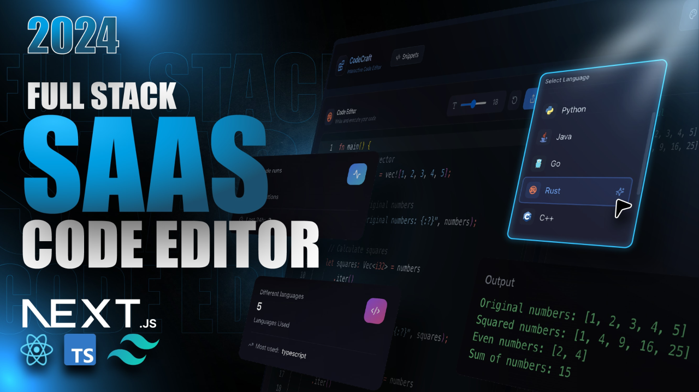

# Code Vortex: Your Collaborative Code Playground

[](https://opensource.org/licenses/MIT)

**Code Vortex** is a powerful and intuitive web application designed for developers to write, execute, and share code snippets in real-time. Whether you're experimenting with a new language, collaborating on a piece of code, or saving useful snippets for later, Code Vortex provides a seamless and efficient platform for all your coding needs.

## ✨ Features

- **👨‍💻 Multi-Language Support**: Write and execute code in a variety of popular languages, including JavaScript, Python, TypeScript, and more.
- **🚀 Real-Time Execution**: Get instant feedback with a powerful code execution engine.
- **🔗 Snippet Sharing**: Share your code snippets with a single click and collaborate with others.
- **🔐 Authentication**: Secure user authentication and authorization powered by Clerk.
- **📊 User Statistics**: Track your coding activity and see insightful statistics on your profile.
- **🖥️ Monaco Editor**: A rich and performant code editor experience, the same one that powers VS Code.
- **🌗 Light & Dark Modes**: Switch between themes for your preferred coding environment.
- **💰 Pro Tier with Stripe**: Unlock premium features with a subscription plan managed through Lemon Squeezy and Stripe.

## 📸 Screenshots

<p align="center">
  
</p>

## 🛠️ Tech Stack

- **Frontend**: [Next.js](https://nextjs.org/), [React](https://reactjs.org/), [TypeScript](https://www.typescriptlang.org/), [Tailwind CSS](https://tailwindcss.com/)
- **Backend**: [Convex](https://www.convex.dev/)
- **Authentication**: [Clerk](https://clerk.com/)
- **Code Editor**: [Monaco Editor](https://microsoft.github.io/monaco-editor/)
- **Payments**: [Lemon Squeezy](https://www.lemonsqueezy.com/), [Stripe](https://stripe.com/)
- **UI Components**: [Lucide React](https://lucide.dev/guide/react), [Framer Motion](https://www.framer.com/motion/)
- **State Management**: [Zustand](https://zustand-demo.pmnd.rs/)

## 🏗️ Architecture

Code Vortex is built with a modern, serverless architecture:

-   **Next.js Frontend**: The application's user interface is a Next.js application, providing server-side rendering, static site generation, and a great developer experience.
-   **Convex Backend**: The backend logic, database, and real-time features are powered by Convex, a serverless platform that simplifies backend development.
-   **Clerk for Authentication**: User management and authentication are handled by Clerk, providing a secure and easy-to-use solution.

## 🚀 Getting Started

To get a local copy up and running, follow these simple steps.

### Prerequisites

- Node.js (v18 or later)
- npm

### Installation

1.  **Clone the repository**:
    ```sh
    git clone https://github.com/akshat2635/code-vortex.git
    cd code-vortex
    ```
2.  **Install NPM packages**:
    ```sh
    npm install
    ```
3.  **Set up Convex**:
    ```sh
    npx convex dev
    ```
    This will guide you through the process of setting up your Convex backend. You will need to create a `.env.local` file and add your Convex deployment URL.
4.  **Set up Clerk**:
    -   Create a Clerk account and a new application.
    -   Add your Clerk public and secret keys to your `.env.local` file.
5.  **Run the development server**:
    ```sh
    npm run dev
    ```
6.  **Open the application**:
    Open [http://localhost:3000](http://localhost:3000) with your browser to see the result.

## 📂 Project Structure

```bash
code-vortex
├── public
│   ├── screenshot-for-readme.png
│   └── ...other public assets
├── src
│   ├── components
│   │   ├── Editor.tsx
│   │   ├── Navbar.tsx
│   │   └── ...other components
│   ├── pages
│   │   ├── api
│   │   │   └── ...API routes
│   │   ├── _app.tsx
│   │   ├── _document.tsx
│   │   └── index.tsx
│   ├── styles
│   │   ├── globals.css
│   │   └── ...other styles
│   ├── utils
│   │   └── ...utility functions
│   └── ...other source files
├── .env.example
├── .gitignore
├── convex.json
├── package.json
└── tsconfig.json
```

## 🤝 Contributing

We welcome contributions from the community! To contribute:

1. Fork the repository.
2. Create a new branch: `git checkout -b feature/YourFeatureName`.
3. Commit your changes: `git commit -m 'Add some feature'`.
4. Push to the branch: `git push origin feature/YourFeatureName`.
5. Open a pull request.

Please ensure your code adheres to our coding standards and includes appropriate tests.

## 📝 License

This project is licensed under the MIT License. See the [LICENSE](LICENSE) file for more details.

## 📫 Contact

For questions or suggestions, feel free to reach out:

- **Name**: Akshat
- **GitHub**: [akshat2635](https://github.com/akshat2635)
- **Email**: [akshatjain2635@gmail.com](mailto:akshatjain2635@gmail.com)

---


